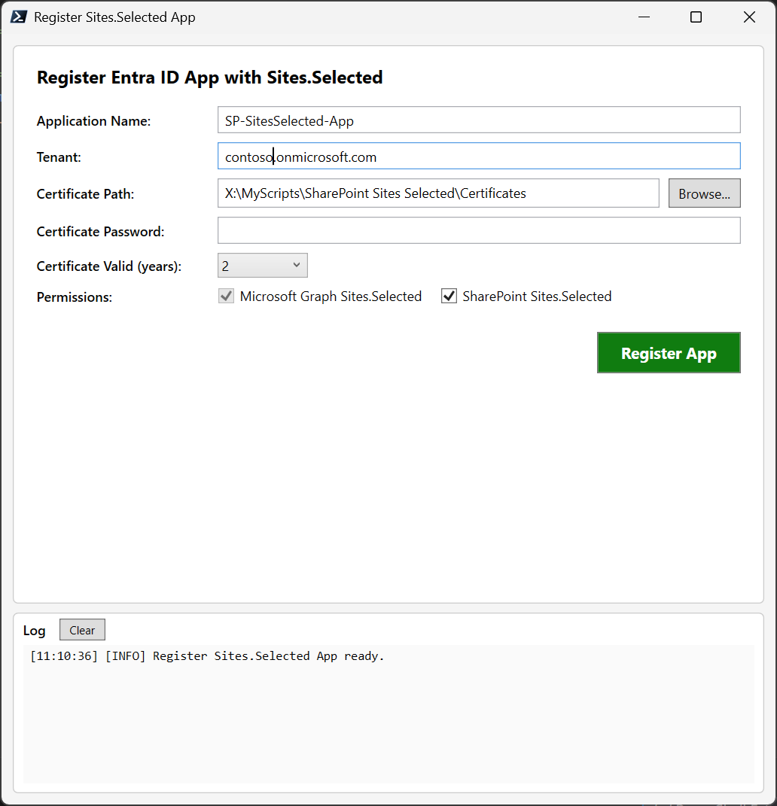
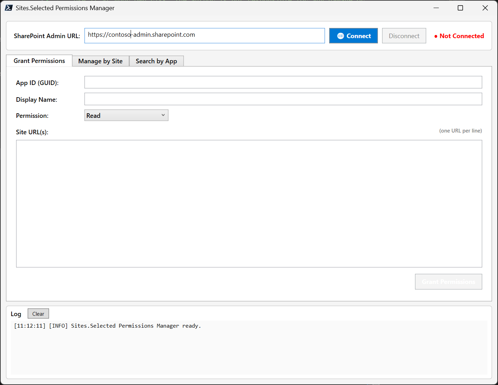
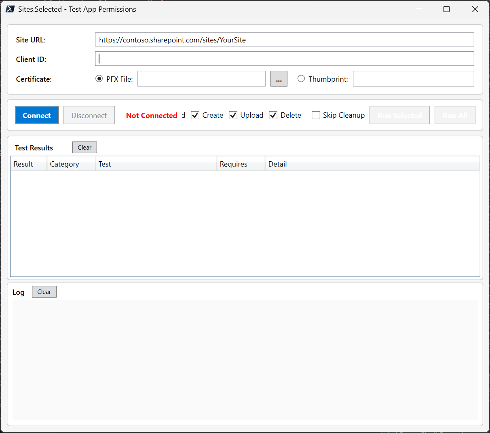

# SharePoint Sites.Selected Permission Manager

Manage **Sites.Selected** permissions for Entra ID app registrations using [PnP.PowerShell](https://pnp.github.io/powershell/).

## What is Sites.Selected?

By default, SharePoint application permissions grant access to **all** sites in a tenant. The **Sites.Selected** permission changes this — it lets you grant an app access to **only the specific sites it needs**.

This solution provides three GUI tools to register an app, manage its per-site access, and test the results:

| Script | Purpose |
|---|---|
| `Register-SitesSelectedAppGUI.ps1` | Register an Entra ID app with Sites.Selected permissions and a self-signed certificate |
| `Manage-SitesSelectedGUI.ps1` | Grant, view, update, and revoke per-site permissions for registered apps |
| `Test-SitesSelectedAccess.ps1` | Test the registered app's access to a site using certificate authentication |

## Prerequisites

- **PowerShell 7+**
- **[PnP.PowerShell](https://pnp.github.io/powershell/)** module installed
- **Roles required:**
  - **Global Administrator** or **Application Administrator** — to register the app
  - **SharePoint Administrator** — to manage Sites.Selected permissions

## Getting Started

### Step 1 — Register the App

Run the registration GUI:

```powershell
.\Register-SitesSelectedAppGUI.ps1
```

Fill in the form:

| Field | Description |
|---|---|
| Application Name | Display name for the Entra ID app (e.g., `My-SitesSelected-App`) |
| Tenant | Your tenant domain (e.g., `contoso.onmicrosoft.com`) |
| Certificate Path | Folder to save the certificate files (default: `.\Certificates\`) |
| Certificate Password | Password to protect the PFX file |
| Certificate Valid (years) | Certificate validity period (1, 2, 3, 5, or 10 years) |
| Permissions | Microsoft Graph Sites.Selected is always included. SharePoint Sites.Selected is optional |

Click **Register App**. A browser window opens for authentication — sign in with a Global Admin or Application Admin account. A separate PowerShell window handles the registration process while the GUI stays responsive.

On success, the GUI displays the **Client ID**, **Certificate Thumbprint**, and **PFX file path**. A summary file is saved to the certificate output folder.

<p align="center">
  
</p>

> **Important:** After registration, a Global Admin must grant admin consent in the Azure Portal:
> Entra ID → App registrations → *Your App* → API Permissions → **Grant admin consent**

### Step 2 — Manage Site Permissions

Run the management GUI:

```powershell
.\Manage-SitesSelectedGUI.ps1
```

1. Enter your **SharePoint Admin URL** (e.g., `https://contoso-admin.sharepoint.com`)
2. Click **Connect** and sign in via the browser

<p align="center">
  
</p>

The tool has three tabs:

#### Grant Permissions

Grant an app access to one or more sites:
- Enter the **App ID** (Client ID) and a **Display Name**
- Select the permission level: **Read**, **Write**, **Manage**, or **FullControl**
- Enter one or more **site URLs** (one per line)
- Click **Grant Permissions**

#### Manage by Site

View and manage all app permissions on a specific site:
- Enter a **Site URL** and click **Load Permissions**
- View all apps with Sites.Selected access to that site
- **Update** a permission level or **Revoke** access

#### Search by App

Find every site where a specific app has permissions:
- Enter the **App ID**
- Click **Search All Sites** — scans all sites in the tenant
- Results show each site URL and the app's permission level

### Step 3 — Test App Permissions

Verify that the registered app can access the sites you granted permissions to:

```powershell
.\Test-SitesSelectedAccess.ps1
```

1. Enter the **Site URL**, **Client ID**, and select the **certificate** (PFX file or thumbprint)
2. Click **Connect** to authenticate as the app
3. Select which tests to run and click **Run Selected** or **Run All**

Available tests:

| Test | What it does | Permission needed |
|---|---|---|
| **Read** | Gets site properties, lists all lists, reads the Documents library | Read |
| **Create** | Creates a test list with sample items and reads them back | Write |
| **Upload** | Uploads a test file to the Documents library and verifies it | Write |
| **Delete** | Removes the test list and uploaded file created by previous tests | Manage or FullControl |

Results appear in a color-coded grid — green for PASS, red for FAIL. Use the **Skip Cleanup** checkbox to keep test items on the site for manual inspection.

<p align="center">
  
</p>

### Step 4 — Connect as the App in Your Scripts

Once the app has been granted access to specific sites, connect using certificate authentication:

```powershell
Connect-PnPOnline -Url "https://contoso.sharepoint.com/sites/TargetSite" `
    -ClientId "your-app-client-id" `
    -Tenant "contoso.onmicrosoft.com" `
    -CertificatePath ".\Certificates\YourApp.pfx" `
    -CertificatePassword (ConvertTo-SecureString "YourPassword" -AsPlainText -Force)
```

The app can only access sites where permissions were explicitly granted.

## How It Works

```
┌──────────────────────────────────────────────────────────────┐
│  Entra ID App Registration                                   │
│  • Sites.Selected (Application permission)                   │
│  • Certificate-based authentication                          │
└──────────────┬───────────────────────────────────────────────┘
               │  Admin grants access per-site
               ▼
    ┌──────────────────┐  ┌──────────────────┐
    │  Site A (Read)   │  │  Site B (Write)  │  ...
    └──────────────────┘  └──────────────────┘
```

1. Register the app with Sites.Selected permission and grant admin consent
2. Use the management GUI to grant the app access to specific sites
3. The app authenticates with its certificate and can access only those sites

## PnP.PowerShell Cmdlets Used

| Cmdlet | Purpose |
|---|---|
| `Register-PnPEntraIDApp` | Creates the Entra ID app with a self-signed certificate |
| `Connect-PnPOnline` | Connects to SharePoint Online |
| `Get-PnPTenantSite` | Lists all site collections in the tenant |
| `Grant-PnPEntraIDAppSitePermission` | Grants an app access to a site |
| `Get-PnPEntraIDAppSitePermission` | Lists app permissions on a site |
| `Set-PnPEntraIDAppSitePermission` | Updates an app's permission level on a site |
| `Revoke-PnPEntraIDAppSitePermission` | Removes an app's access to a site |
| `Invoke-PnPGraphMethod` | Queries Microsoft Graph API for permission details |
| `Get-PnPSite` | Gets site properties (used in test script) |
| `Get-PnPList` | Lists all lists on a site (used in test script) |
| `New-PnPList` | Creates a test list (used in test script) |
| `Add-PnPListItem` | Adds items to a list (used in test script) |
| `Add-PnPFile` | Uploads a file to a library (used in test script) |
| `Remove-PnPList` | Removes a test list (used in test script) |
| `Remove-PnPFile` | Removes a test file (used in test script) |

## Troubleshooting

| Issue | Solution |
|---|---|
| Module not found | Install PnP.PowerShell: `Install-Module PnP.PowerShell -Scope CurrentUser -Force` |
| Access denied when granting permissions | Sign in as SharePoint Admin. Ensure admin consent was granted for the PnP Management Shell app |
| Sites.FullControl.All error | The PnP Management Shell needs Sites.FullControl.All consent in your tenant |
| App can't access a site | Verify the permission was granted using the "Manage by Site" tab |
| Search by App is slow | The search queries each site individually — expected for large tenants |
| Registration window freezes | The registration runs in a separate process. If it fails, check the log panel for details |

## License

MIT
